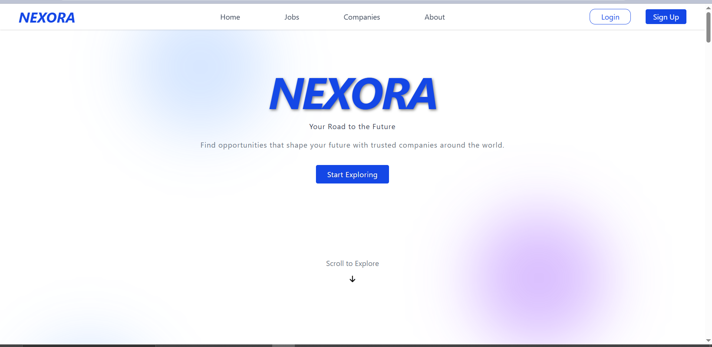
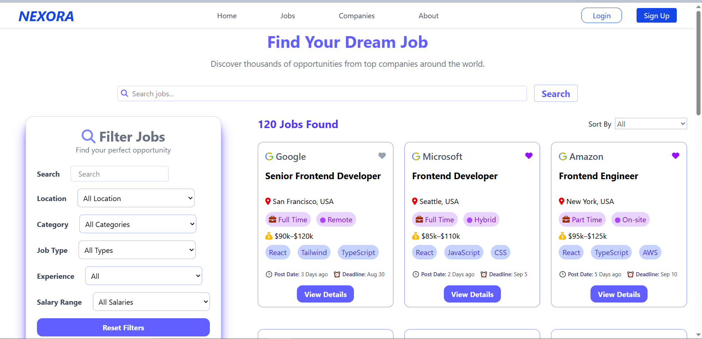
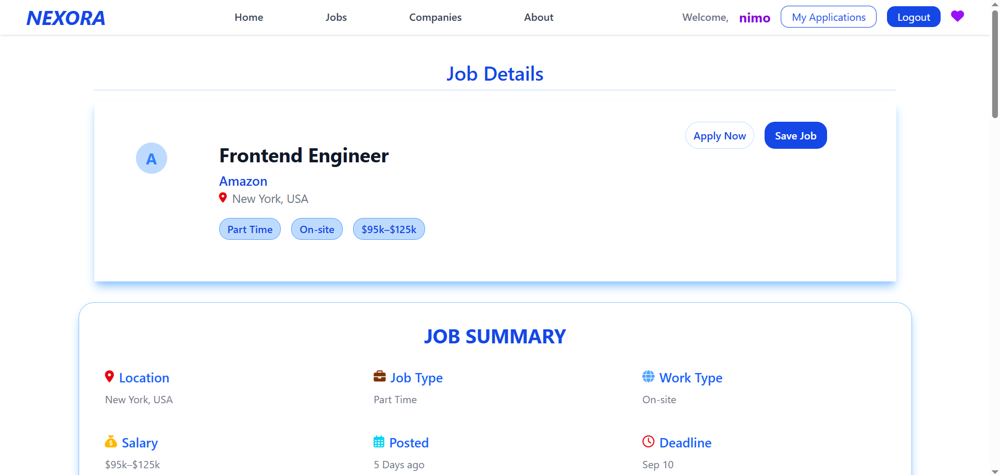
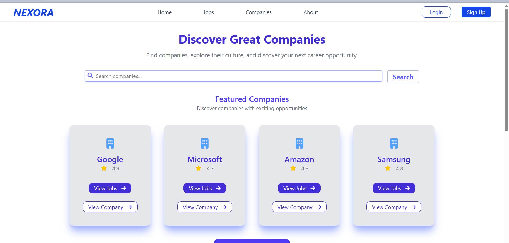
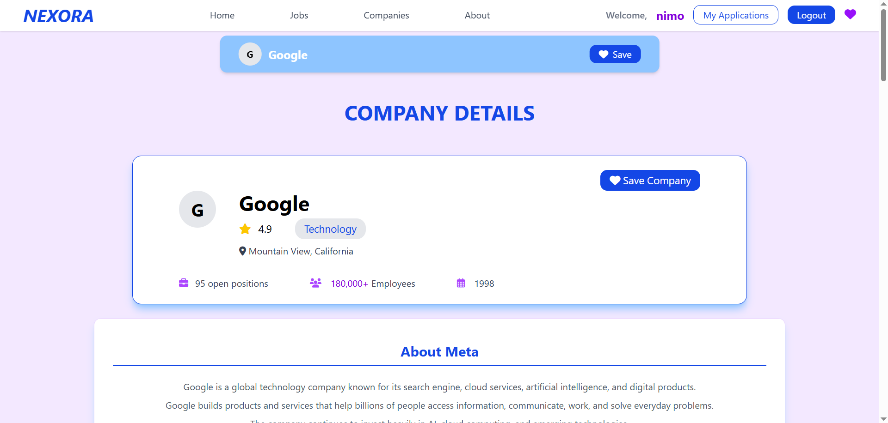
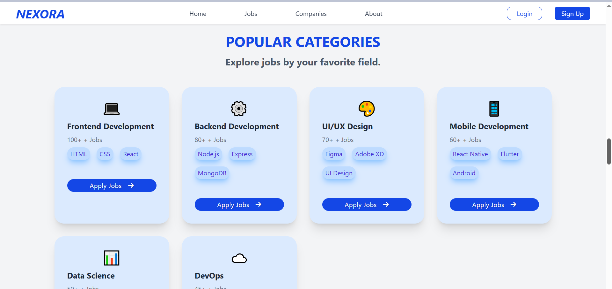
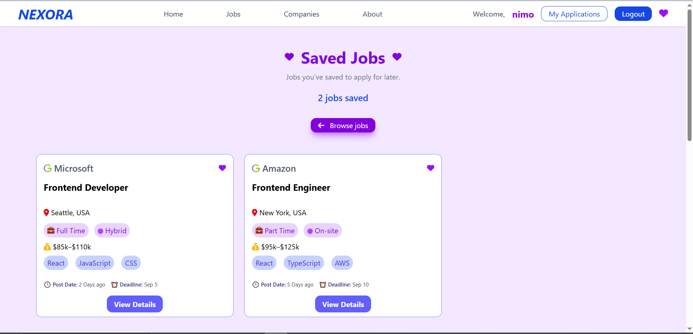
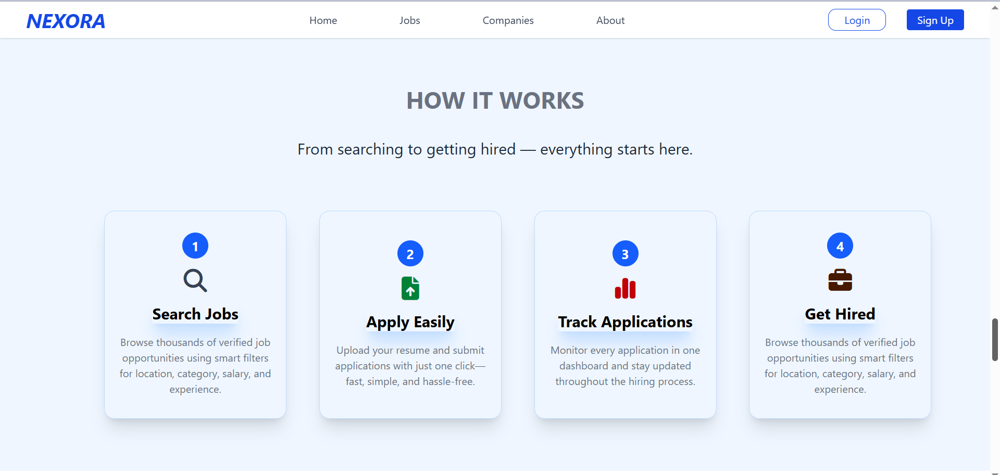
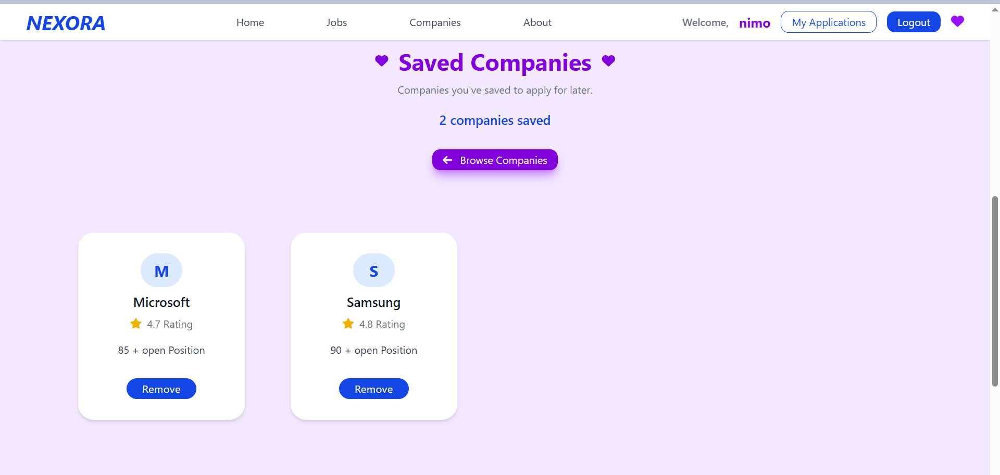

# NEXORA — Your Road to the Future

NEXORA is a modern job portal built with React and Tailwind CSS, designed to help job seekers discover and explore career opportunities through a clean and user-friendly interface. Users can search and filter jobs, view detailed job information, explore companies, save jobs and companies, and submit job applications with their CV.
The My Applications page allows users to view all the jobs they have applied for in one place.
The project focuses on creating a complete and practical job-seeking experience while demonstrating modern frontend development with React.

----------------------------------------

##  Features ✨

- 🔍 **Job Search & Filtering** — Search jobs and filter them by location, category, job type, experience, and  salary.
- 📄 **Job Details** — View complete job information, including requirements, responsibilities, benefits, salary, and company details.
- 🔐 **User Authentication** — Sign up and log in to access application features.
- 📝 **Job Application** — Apply for jobs through a dedicated application form and submit a CV.
- 📋 **My Applications** — View all applied jobs in one place.
- 💾 **Save Jobs** — Save interesting jobs and manage them from the Saved Jobs page.
- ❤️ **Save Companies** — Save companies for easy access later.
- 🏢 **Company Profiles** — Explore company information, available jobs, benefits, and work culture.
- ✓ **Applied Status** — Easily identify jobs that have already been applied for.
- 📱 **Responsive Design** — Responsive interface designed for a smooth experience across different screen sizes.

------------------------------------

##  Tech Stack 🛠️

* **React.js** — Building the user interface and reusable components
* **JavaScript** — Application logic and functionality
* **Tailwind CSS** — Styling and responsive design
* **React Router** — Page navigation and routing
* **LocalStorage** — Storing user data, saved jobs, saved companies, and applications
* **HTML5** — Page structure

-------------------------

## Screenshots 📸

###  Home Page


###  Login Page


###  Jobs Page


###  Job-Details Page


###  Signup Page


###  Companies Page


###  Company-details Page


###  Popular-Category Page


###  Save-Jobs Page


###  My-Applications Page


###  How-it-Works Page


###  Save-Company Page


###  Job-Apply-Application Page


###  About Page


---------------------------------------------

## LIVE DEMO

- [CLICK HERE FOR EXPERIENCE NEXORA YOURSELF]()

-----------------------------------

## Clone the Repository
```bash
git clone https://github.com/Amnaakhtar1213/job-portal.git


